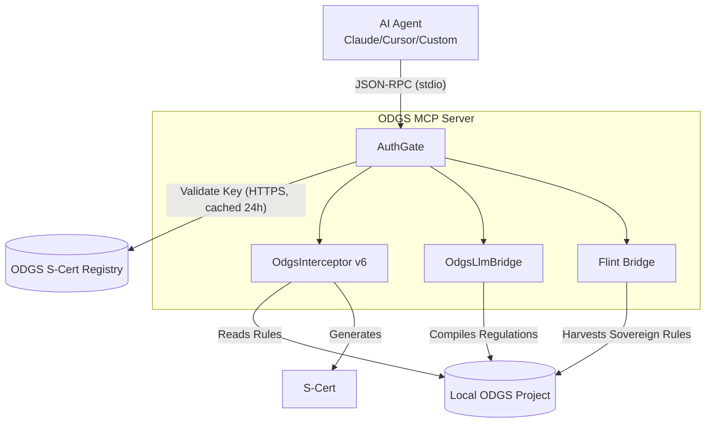

# Open Data Governance Standard (ODGS) — MCP Server

> **Runtime governance enforcement for any AI agent.**

[-0055AA)](https://platform.metricprovenance.com)
[](https://modelcontextprotocol.io/)
[](https://www.python.org/downloads/)
[](LICENSE)

---

> **For engineers:** See [Quick Start](#quick-start) below.  
> **For compliance, legal, or procurement teams:** Your organisation may already be running ODGS.  
> [Request a technical partner briefing →](https://platform.metricprovenance.com#partner-enquiry)  
> **Consulting or platform partner?** See [PARTNERS.md](PARTNERS.md) for the commercial model.

---


## Why ODGS MCP?

Every AI agent that touches regulated data needs a compliance conscience. ODGS provides the industry's only open standard that produces **cryptographic audit certificates (S-Certs)** — machine-verifiable proof that governance rules were evaluated at runtime.

This server puts that enforcement capability inside any AI agent's tool context, bridging the deterministic governance engine with probabilistic AI agents.

## Features

- **Runtime Validation:** Validate data payloads against sovereign governance rules in real-time.
- **Flint Bridge Integration (Enterprise):** Allow your agent to harvest, extract, and auto-mint sovereign rules from enterprise catalogs.
- **LLM Bridge (Pro):** Compile raw legal text (EU AI Act, DORA, GDPR) into enforceable machine rules.
- **Drift & Conflict Detection:** Automatically detect semantic drift in governance definitions and resolve regulatory contradictions.
- **Audit Narratives:** Convert cryptic S-Certs into human-readable compliance reports.

## Quick Start

```bash
# Core validation capabilities
pip install odgs-mcp-server

# Complete installation with LLM bridge capabilities
pip install "odgs-mcp-server[llm]"
```

### Client Configuration

The server operates over standard **stdio transport**, making it instantly compatible with any MCP client. 

<details>
<summary><b>Claude Desktop</b></summary>

Add to `claude_desktop_config.json`:
```json
{
  "mcpServers": {
    "odgs-governance": {
      "command": "odgs-mcp-server",
      "args": ["--transport", "stdio"],
      "env": {
        "ODGS_PROJECT_ROOT": "/path/to/your/odgs/project"
      }
    }
  }
}
```
</details>

<details>
<summary><b>Cursor</b></summary>

Add to `.cursor/mcp.json`:
```json
{
  "mcpServers": {
    "odgs-governance": {
      "command": "odgs-mcp-server",
      "args": ["--transport", "stdio"],
      "env": {
        "ODGS_PROJECT_ROOT": "/path/to/your/odgs/project"
      }
    }
  }
}
```
</details>

### Pro & Enterprise Authentication

To unlock regulatory compilation, certified packs, and catalog synchronization, provide your ODGS API key:

```json
"env": {
  "ODGS_API_KEY": "sk-odgs-...",
  "ODGS_PROJECT_ROOT": "/path/to/your/odgs/project"
}
```
*Get your API key at [platform.metricprovenance.com](https://platform.metricprovenance.com).*

---

## Tools Reference

### Community (Free)
| Tool | Description |
|:---|:---|
| `validate_payload` | Validate data against ODGS governance rules, produce S-Cert |
| `validate_batch` | Validate multiple payloads in one call |
| `list_packs` | List available Certified Regulation Packs |
| `governance_score` | Score governance maturity (0-100) across 4 categories |
| `conformance_check` | Run ODGS conformance self-check (L1/L2) |

### Professional (API Key Required)
| Tool | Description |
|:---|:---|
| `download_pack` | Download and cache certified regulatory rule packs locally |
| `compile_regulation` | Convert regulation text → validated ODGS rule JSON |
| `check_drift` | Detect semantic drift in governance definitions |
| `detect_conflicts` | Find contradictions between regulatory rules |
| `narrate_audit` | Convert S-Cert → human-readable narrative |
| `discover_bindings` | Auto-generate physical data mappings from catalogs |

### Enterprise (API Key Required)
| Tool | Description |
|:---|:---|
| `harvest_sovereign_rules` | (Flint Bridge) Automatically extract and mint rules from data stores |
| `sync_catalog` | Pull metadata from Databricks / Snowflake / Collibra |

---

## Architecture

The ODGS MCP Server is designed for **zero-trust, local-first execution**. All data validation happens strictly on your machine. No sensitive data leaves your perimeter.



---

## Certified Regulation Packs

Pre-built, cryptographically signed rule bundles for immediate compliance enforcement:

| Pack | Regulation | Status |
|:---|:---|:---|
| **EU AI Act** | Regulation (EU) 2024/1689 | ✅ Certified |
| **DORA** | Digital Operational Resilience Act | ✅ Certified |
| **GDPR** | General Data Protection Regulation | ✅ Certified |
| **CSRD** | Corporate Sustainability Reporting Directive | ✅ Certified |
| **NIS2** | Network and Information Security Directive | ✅ Certified |
| **Basel III** | Banking Regulation | ✅ Certified |

*Full catalog of 15+ packs available via [platform.metricprovenance.com](https://platform.metricprovenance.com). For pricing and enterprise licensing, contact [partner@metricprovenance.com](mailto:partner@metricprovenance.com).*

---

## Environment Variables

| Variable | Description | Default |
|:---|:---|:---|
| `ODGS_PROJECT_ROOT` | Path to ODGS governance definitions | Current directory |
| `ODGS_API_KEY` | API key for Professional/Enterprise access | None (community) |
| `ODGS_REGISTRY_URL` | Registry endpoint for key validation | `https://registry.metricprovenance.com` |
| `ODGS_CACHE_DIR` | Local cache for downloaded packs | `~/.odgs/cache` |

---

## About ODGS

The Open Data Governance Standard is a sovereign enforcement protocol that validates data operations against governance rules at runtime — not retroactively. It produces cryptographic S-Certs (Sovereign Certificates) that serve as machine-verifiable audit trails.

- [ODGS Documentation](https://metricprovenance.com)
- [ODGS on PyPI](https://pypi.org/project/odgs/)
- [Research Paper (SSRN)](https://papers.ssrn.com/abstract=6205478)
- [Partner Platform](https://platform.metricprovenance.com)

## License

Apache 2.0 — see [LICENSE](LICENSE).

The ODGS engine and MCP server are open source. Certified Regulation Packs are commercially licensed.
