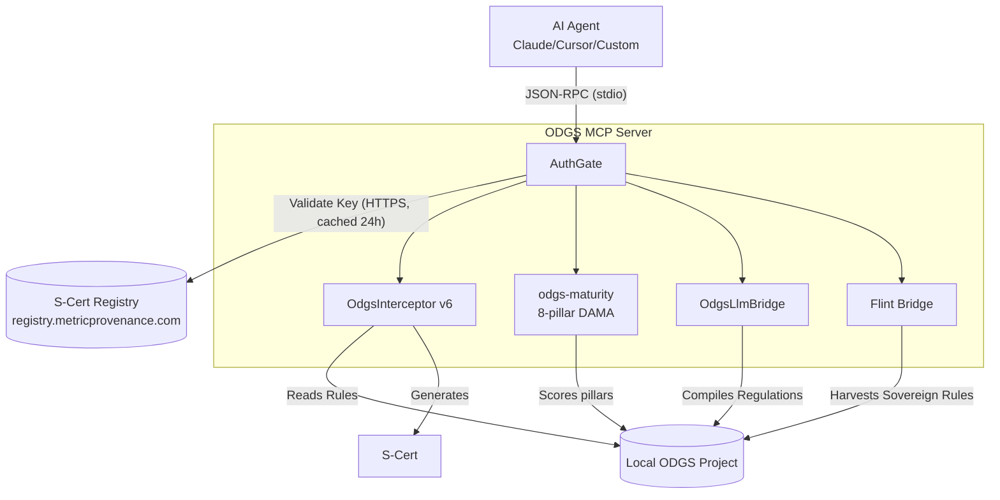

# Open Data Governance Standard (ODGS) — MCP Server

> **Deterministic governance enforcement at the AI agent boundary.**

[-0055AA)](https://metricprovenance.com/pricing)
[](https://modelcontextprotocol.io/)
[](https://pypistats.org/packages/odgs-mcp-server)
[](https://www.python.org/downloads/)
[](LICENSE)

---

> **For engineers:** See [Quick Start](#quick-start) below.  
> **For compliance and risk officers:** The ODGS engine generates cryptographic audit trails (S-Certs).  
> **For architectural clearance and certified packs:** [metricprovenance.com/pricing](https://metricprovenance.com/pricing)

---

> [!IMPORTANT]
> **ODGS MCP Server v0.3.1 — Maturity Diagnostics + Certified Pack Access**
> `governance_score` now delegates to the **`odgs-maturity`** 8-pillar DAMA DMBOK engine.
> Regulatory compilation, drift detection, and catalog synchronisation require a Certified Pack licence.
> The community tier — validation, scoring, conformance checking — remains open with no registration.

---

### Core Capabilities

| Change | Detail |
|---|---|
| **`governance_score`** | Delegates to `odgs-maturity` (8-pillar DAMA DMBOK) when installed; falls back to built-in heuristic. Returns 0–100 score with per-pillar gap analysis. |
| **AuthGate** | Community / Professional / Enterprise access via API key validation. 24h disk cache; `workspace.yaml` fallback for air-gapped deployments. |
| **Licensed tools** | `compile_regulation`, `check_drift`, `detect_conflicts`, `narrate_audit`, `discover_bindings` (Professional); `sync_catalog`, `harvest_sovereign_rules` (Enterprise). |

> The European Data Governance Maturity Benchmark 2026 recorded an average maturity of **37.6%** across 99 enterprises — a **62.4% gap** against current regulatory expectation. `governance_score` applies the same assessment methodology to your project.

---

## What This Is

The ODGS MCP Server connects any MCP-compatible AI agent to the ODGS Sovereign Validation Engine. The engine evaluates data operations against governance rules at runtime and produces **S-Certs (Sovereign Certificates)** — cryptographically signed, machine-verifiable records that a governance rule was applied.

This is the bridge between probabilistic AI inference and deterministic governance enforcement.

### EU AI Act & High-Risk AI Systems

Organisations operating High-Risk AI Systems under **EU AI Act Articles 10 and 12** require demonstrable, auditable data governance at the pipeline level. S-Certs provide that audit trail in a format suitable for regulatory submission.

Certified Sovereign Packs and the S-Cert Registry are available through Metric Provenance certified implementation partners. For architectural assessment: [metricprovenance.com/pricing](https://metricprovenance.com/pricing).

---

## Capabilities

- **Runtime validation:** Data payloads are evaluated against sovereign governance rules at call time; each evaluation produces a signed S-Cert.
- **Governance maturity scoring:** 8-pillar DAMA DMBOK assessment (0–100) with per-pillar gap analysis, aligned to the European Governance Maturity Benchmark methodology.
- **Regulatory compilation** *(licensed)*: Converts legislative text — EU AI Act, DORA, GDPR — into validated ODGS rule JSON.
- **Semantic drift detection** *(licensed)*: Identifies definitional drift between governance artefacts across versions.
- **Enterprise catalog integration** *(licensed)*: Harvests and mints sovereign rules from Databricks, Snowflake, and Collibra via the Flint Bridge.

---

## Quick Start

```bash
# Core validation capabilities (free, no account needed)
pip install odgs-mcp-server

# With maturity scoring
pip install odgs-mcp-server odgs-maturity

# Complete installation with LLM bridge capabilities
pip install "odgs-mcp-server[llm]"
```

### Client Configuration

The server operates over standard **stdio transport**, making it instantly compatible with any MCP client.

<details>
<summary><b>Claude Desktop</b></summary>

Add to `claude_desktop_config.json`:
```json
{
  "mcpServers": {
    "odgs-governance": {
      "command": "odgs-mcp-server",
      "args": ["--transport", "stdio"],
      "env": {
        "ODGS_PROJECT_ROOT": "/path/to/your/odgs/project"
      }
    }
  }
}
```
</details>

<details>
<summary><b>Cursor</b></summary>

Add to `.cursor/mcp.json`:
```json
{
  "mcpServers": {
    "odgs-governance": {
      "command": "odgs-mcp-server",
      "args": ["--transport", "stdio"],
      "env": {
        "ODGS_PROJECT_ROOT": "/path/to/your/odgs/project"
      }
    }
  }
}
```
</details>

### Licensed Tool Access

Regulatory compilation, certified packs, and catalog synchronisation require a Certified Pack licence. Provide the issued API key in your client configuration:

```json
"env": {
  "ODGS_API_KEY": "sk-odgs-...",
  "ODGS_PROJECT_ROOT": "/path/to/your/odgs/project"
}
```
**Licences are self-serve** — buy at [metricprovenance.com/pricing](https://metricprovenance.com/pricing) and your key is emailed on purchase:

| Tier | Price | Includes |
|:---|:---|:---|
| **Community** | Free | `validate_payload`, `governance_score`, `list_packs`, `conformance_check` — no registration |
| **Team** | €990/yr | One certified regulation pack, signed + updated, plus all Professional tools |
| **Professional** | €2,490/yr | All certified packs, priority re-signing on regulatory change |
| **Consultant** | €4,990/yr | Professional + white-label / client-deliverable rights |

*Enterprise deployments (Sovereign CA nodes, `sync_catalog`, `harvest_sovereign_rules`) via [certified partners](https://metricprovenance.com/pricing).*

---

## Tools Reference

### Community (Free — no API key required)
| Tool | Description |
|:---|:---|
| `validate_payload` | Validate data against ODGS governance rules, produce S-Cert |
| `validate_batch` | Validate multiple payloads in one call |
| `list_packs` | List available Certified Regulation Packs |
| `governance_score` | Score governance maturity (0–100) across 8 DAMA pillars with gap analysis |
| `conformance_check` | Run ODGS conformance self-check (L1/L2) |

### Professional (API Key Required)
| Tool | Description |
|:---|:---|
| `download_pack` | Download and cache certified regulatory rule packs locally |
| `compile_regulation` | Convert regulation text → validated ODGS rule JSON |
| `check_drift` | Detect semantic drift in governance definitions |
| `detect_conflicts` | Find contradictions between regulatory rules |
| `narrate_audit` | Convert S-Cert → human-readable narrative |
| `discover_bindings` | Auto-generate physical data mappings from catalogs |

### Enterprise (API Key Required)
| Tool | Description |
|:---|:---|
| `harvest_sovereign_rules` | (Flint Bridge) Automatically extract and mint rules from data stores |
| `sync_catalog` | Pull metadata from Databricks / Snowflake / Collibra |

---

## Architecture

The ODGS MCP Server is designed for **zero-trust, local-first execution**. All data validation happens strictly on your machine. No sensitive data leaves your perimeter.


```mermaid
flowchart TB
    Agent[AI Agent\nClaude/Cursor/Custom]
    
    subgraph "ODGS MCP Server"
        Auth[AuthGate]
        Val[OdgsInterceptor v6]
        Maturity[odgs-maturity\n8-pillar DAMA]
        LLM[OdgsLlmBridge]
        Flint[Flint Bridge]
    end
    
    Reg[(S-Cert Registry\nregistry.metricprovenance.com)]
    Project[(Local ODGS Project)]

    Agent -- "JSON-RPC (stdio)" --> Auth
    Auth -- "Validate Key (HTTPS, cached 24h)" --> Reg
    Auth --> Val
    Auth --> Maturity
    Auth --> LLM
    Auth --> Flint
    
    Val -- "Reads Rules" --> Project
    Val -- "Generates" --> SCert[S-Cert]
    Maturity -- "Scores pillars" --> Project
    LLM -- "Compiles Regulations" --> Project
    Flint -- "Harvests Sovereign Rules" --> Project
```

---

## Certified Regulation Packs

Cryptographically signed rule bundles, each mapped to a specific regulatory instrument. Packs are compiled from authoritative legislative text and certified by Metric Provenance.

| Pack | Regulation | Status |
|:---|:---|:---|
| **EU AI Act** | Regulation (EU) 2024/1689 | ✅ Certified |
| **DORA** | Digital Operational Resilience Act | ✅ Certified |
| **GDPR** | General Data Protection Regulation | ✅ Certified |
| **CSRD** | Corporate Sustainability Reporting Directive | ✅ Certified |
| **NIS2** | Network and Information Security Directive | ✅ Certified |
| **Basel III** | Basel Committee on Banking Supervision | ✅ Certified |

*Full catalogue of 15+ packs. Licensing and deployment via [metricprovenance.com/pricing](https://metricprovenance.com/pricing).*

---

## Environment Variables

| Variable | Description | Default |
|:---|:---|:---|
| `ODGS_PROJECT_ROOT` | Path to ODGS governance definitions | Current directory |
| `ODGS_API_KEY` | API key for Professional/Enterprise access | None (community) |
| `ODGS_REGISTRY_URL` | Registry endpoint for key validation | `https://registry.metricprovenance.com` |
| `ODGS_CACHE_DIR` | Local cache for downloaded packs | `~/.odgs/cache` |

---

## About ODGS

The Open Data Governance Standard (ODGS) is an open protocol for deterministic data governance enforcement. ODGS is on a path toward formal standardization.

- [Protocol specification](https://github.com/MetricProvenance/odgs) — `pip install odgs`
- [PyPI package](https://pypi.org/project/odgs-mcp-server/)
- [Research paper (SSRN 6205478)](https://papers.ssrn.com/abstract=6205478)
- [Metric Provenance](https://metricprovenance.com/pricing)

## Licence

Apache 2.0 — see [LICENSE](LICENSE).

The protocol engine and MCP server are open source. Certified Regulation Packs are issued under a commercial licence.

