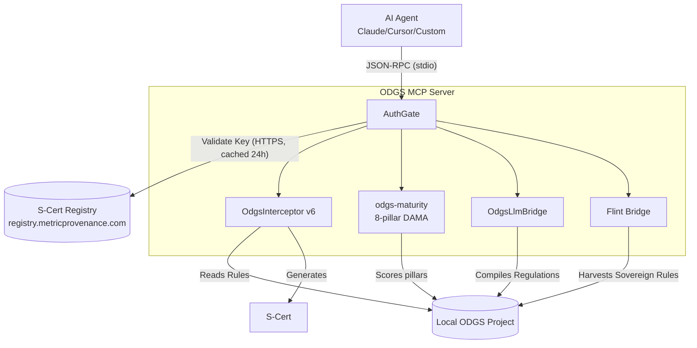

# Open Data Governance Standard (ODGS) — MCP Server

> **Runtime governance enforcement for any AI agent.**

[-0055AA)](https://metricprovenance.com/brief)
[](https://modelcontextprotocol.io/)
[](https://pypistats.org/packages/odgs-mcp-server)
[](https://www.python.org/downloads/)
[](LICENSE)

---

> **For engineers:** See [Quick Start](#quick-start) below.  
> **For compliance and risk officers:** The ODGS engine generates cryptographic audit trails (S-Certs).  
> **For architectural clearance and certified packs:** [metricprovenance.com/brief](https://metricprovenance.com/brief)

---

> [!IMPORTANT]
> **ODGS MCP Server v0.2.0 — Maturity Diagnostics + Tier-Gated Enforcement**
> Now delegates `governance_score` to the **`odgs-maturity`** 8-pillar DAMA engine.
> Pro/Enterprise tools (regulatory compilation, drift detection, catalog sync) are gated
> by API key. Community tier remains fully free with no account required.

---

### 🚀 What's New in v0.2.0

| Enhancement | Description |
|---|---|
| **📊 `governance_score`** | Now delegates to `odgs-maturity` (8-pillar DAMA DMBOK) when installed. Falls back to built-in heuristic. Scores 0–100 with per-pillar gap analysis. |
| **AuthGate** | Community / Pro / Enterprise tier gate via API key. 24h disk cache. Offline `workspace.yaml` fallback for air-gapped environments. |
| **Tier-gated tools** | `compile_regulation`, `check_drift`, `detect_conflicts`, `narrate_audit`, `discover_bindings` (Pro); `sync_catalog`, `harvest_sovereign_rules` (Enterprise). |
| **`/brief` CTA** | All in-product upgrade prompts consolidated to `metricprovenance.com/brief`. No stale emails or portal links. |

> 💡 **Industry Benchmark:** The European Data Governance Maturity Benchmark 2026 found an average governance maturity of **37.6%** across 99 enterprises — a **62.4% enforcement gap** against regulatory expectation. Run `governance_score` to see where your project stands.

---

## Why ODGS MCP?

Every AI agent that touches regulated data needs a compliance conscience. ODGS provides the industry's only open standard that produces **cryptographic audit certificates (S-Certs)** — machine-verifiable proof that governance rules were evaluated at runtime.

This server puts that enforcement capability inside any AI agent's tool context, bridging the deterministic governance engine with probabilistic AI agents.

### 🏢 Enterprise & Public Sector: EU AI Act Compliance

If you are operating a **High-Risk AI System** and require strict liability indemnification under the **EU AI Act (Articles 10 & 12)**, you need cryptographic provenance.

**Metric Provenance** offers the commercial infrastructure for ODGS:
- **Certified Sovereign Packs:** Pre-compiled, cryptographically signed Ed25519 rule bundles for DORA, EU AI Act, Basel III, and 12 more regulations.
- **The S-Cert Registry:** An enterprise certificate authority that natively ingests ODGS telemetry to mint immutable, JWS-sealed audit logs.

**Access:** Exclusively through [metricprovenance.com/brief](https://metricprovenance.com/brief).

---

## Features

- **Runtime Validation:** Validate data payloads against sovereign governance rules in real-time.
- **Maturity Scoring:** 8-pillar DAMA DMBOK governance assessment with gap analysis and actionable findings.
- **Flint Bridge Integration (Enterprise):** Allow your agent to harvest, extract, and auto-mint sovereign rules from enterprise catalogs.
- **LLM Bridge (Pro):** Compile raw legal text (EU AI Act, DORA, GDPR) into enforceable machine rules.
- **Drift & Conflict Detection:** Automatically detect semantic drift in governance definitions and resolve regulatory contradictions.
- **Audit Narratives:** Convert cryptic S-Certs into human-readable compliance reports.

---

## Quick Start

```bash
# Core validation capabilities (free, no account needed)
pip install odgs-mcp-server

# With maturity scoring
pip install odgs-mcp-server odgs-maturity

# Complete installation with LLM bridge capabilities
pip install "odgs-mcp-server[llm]"
```

### Client Configuration

The server operates over standard **stdio transport**, making it instantly compatible with any MCP client.

<details>
<summary><b>Claude Desktop</b></summary>

Add to `claude_desktop_config.json`:
```json
{
  "mcpServers": {
    "odgs-governance": {
      "command": "odgs-mcp-server",
      "args": ["--transport", "stdio"],
      "env": {
        "ODGS_PROJECT_ROOT": "/path/to/your/odgs/project"
      }
    }
  }
}
```
</details>

<details>
<summary><b>Cursor</b></summary>

Add to `.cursor/mcp.json`:
```json
{
  "mcpServers": {
    "odgs-governance": {
      "command": "odgs-mcp-server",
      "args": ["--transport", "stdio"],
      "env": {
        "ODGS_PROJECT_ROOT": "/path/to/your/odgs/project"
      }
    }
  }
}
```
</details>

### Pro & Enterprise Authentication

To unlock regulatory compilation, certified packs, and catalog synchronization, provide your ODGS API key:

```json
"env": {
  "ODGS_API_KEY": "sk-odgs-...",
  "ODGS_PROJECT_ROOT": "/path/to/your/odgs/project"
}
```
*Request your API key via [metricprovenance.com/brief](https://metricprovenance.com/brief).*

---

## Tools Reference

### Community (Free — no API key required)
| Tool | Description |
|:---|:---|
| `validate_payload` | Validate data against ODGS governance rules, produce S-Cert |
| `validate_batch` | Validate multiple payloads in one call |
| `list_packs` | List available Certified Regulation Packs |
| `governance_score` | Score governance maturity (0–100) across 8 DAMA pillars with gap analysis |
| `conformance_check` | Run ODGS conformance self-check (L1/L2) |

### Professional (API Key Required)
| Tool | Description |
|:---|:---|
| `download_pack` | Download and cache certified regulatory rule packs locally |
| `compile_regulation` | Convert regulation text → validated ODGS rule JSON |
| `check_drift` | Detect semantic drift in governance definitions |
| `detect_conflicts` | Find contradictions between regulatory rules |
| `narrate_audit` | Convert S-Cert → human-readable narrative |
| `discover_bindings` | Auto-generate physical data mappings from catalogs |

### Enterprise (API Key Required)
| Tool | Description |
|:---|:---|
| `harvest_sovereign_rules` | (Flint Bridge) Automatically extract and mint rules from data stores |
| `sync_catalog` | Pull metadata from Databricks / Snowflake / Collibra |

---

## Architecture

The ODGS MCP Server is designed for **zero-trust, local-first execution**. All data validation happens strictly on your machine. No sensitive data leaves your perimeter.


```mermaid
flowchart TB
    Agent[AI Agent\nClaude/Cursor/Custom]
    
    subgraph "ODGS MCP Server"
        Auth[AuthGate]
        Val[OdgsInterceptor v6]
        Maturity[odgs-maturity\n8-pillar DAMA]
        LLM[OdgsLlmBridge]
        Flint[Flint Bridge]
    end
    
    Reg[(S-Cert Registry\nregistry.metricprovenance.com)]
    Project[(Local ODGS Project)]

    Agent -- "JSON-RPC (stdio)" --> Auth
    Auth -- "Validate Key (HTTPS, cached 24h)" --> Reg
    Auth --> Val
    Auth --> Maturity
    Auth --> LLM
    Auth --> Flint
    
    Val -- "Reads Rules" --> Project
    Val -- "Generates" --> SCert[S-Cert]
    Maturity -- "Scores pillars" --> Project
    LLM -- "Compiles Regulations" --> Project
    Flint -- "Harvests Sovereign Rules" --> Project
```

---

## Certified Regulation Packs

Pre-built, cryptographically signed rule bundles for immediate compliance enforcement:

| Pack | Regulation | Status |
|:---|:---|:---|
| **EU AI Act** | Regulation (EU) 2024/1689 | ✅ Certified |
| **DORA** | Digital Operational Resilience Act | ✅ Certified |
| **GDPR** | General Data Protection Regulation | ✅ Certified |
| **CSRD** | Corporate Sustainability Reporting Directive | ✅ Certified |
| **NIS2** | Network and Information Security Directive | ✅ Certified |
| **Basel III** | Banking Regulation | ✅ Certified |

*Full catalogue of 15+ packs available via [metricprovenance.com/brief](https://metricprovenance.com/brief). Enterprise certification and licensing handled through Metric Provenance partners.*

---

## Environment Variables

| Variable | Description | Default |
|:---|:---|:---|
| `ODGS_PROJECT_ROOT` | Path to ODGS governance definitions | Current directory |
| `ODGS_API_KEY` | API key for Professional/Enterprise access | None (community) |
| `ODGS_REGISTRY_URL` | Registry endpoint for key validation | `https://registry.metricprovenance.com` |
| `ODGS_CACHE_DIR` | Local cache for downloaded packs | `~/.odgs/cache` |

---

## About ODGS

The Open Data Governance Standard is a sovereign enforcement protocol that validates data operations against governance rules at runtime — not retroactively. It produces cryptographic S-Certs (Sovereign Certificates) that serve as machine-verifiable audit trails.

- [ODGS Protocol (core)](https://github.com/MetricProvenance/odgs) — `pip install odgs`
- [ODGS on PyPI](https://pypi.org/project/odgs-mcp-server/)
- [Research Paper (SSRN)](https://papers.ssrn.com/abstract=6205478)
- [Sovereign S-Cert Registry](https://metricprovenance.com/brief)

## License

Apache 2.0 — see [LICENSE](LICENSE).

The ODGS engine and MCP server are open source. Certified Regulation Packs are commercially licensed.

